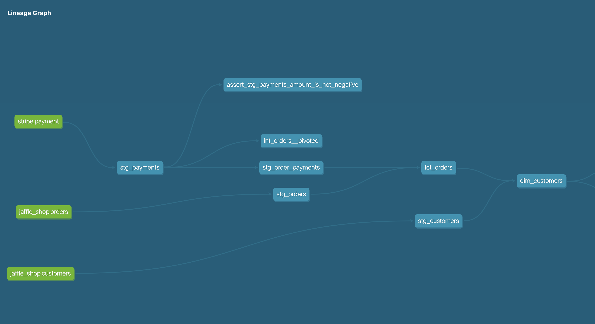

# dbt-spin

This is an attempt to learn how to work with [dbt](https://www.getdbt.com/). dbt (apparently it's supposed to be all lowercase) is a tool that supposedly provides a pleasant experience when working with data analytics workflows. This repository is based on material that is covered in the [dbt Fundamentals](https://courses.getdbt.com/courses/fundamentals) provided by the tool creators.


## Getting started

If you're curious and want to just dive in, start by looking in the `models` directory and look for `.sql` files from left to right as shown in the visual below:



The models (expressed mostly in sql and some python sprinkled in), form the foundation of how a pipeline gets built. In addition, you will see the `ref` and `source` functions that allow referencing other models and compose more complex ones. Refer to the dbt documentation for more.

## Running locally
There are a couple of ways to run this:

* Using the dbt cli
* Using dbt cloud

Either way should work, but dbt cloud provides a few bells and whistles that make it slightly easier (like a code-completing IDE among others).

In addition, you will need to configure, what dbt calls a profile. In this directory, you will find a `dbt_project.yml` file, which contains metadata on where the tool can find the things it needs. In addition, you will need to tell it which _profile_ you want `dbt` to run as shown here:
```yml
# This setting configures which "profile" dbt uses for this project.
profile: 'default'
```
One of the ways to point dbt to a profile is by creating a `profiles.yml` file in a `.dbt` directory in your home directory. I have a sample to get you started as a convenience (look at `profiles-sample.yml`).

## Common commands
Here are a few commands that I used quite often as part of developing this simple application:

```bash
# This allows actually running the code
# i.e. pulling data from the sources,
# running the transformations as per the DAG
# and populating the target tables. 
dbt run
```

```bash
# This allows you to run tests
# that you may have written against
# the models.
dbt test
```
You can see some sample tests in the `tests` directory. In addition, you can embed what dbt calls [generic tests](https://docs.getdbt.com/docs/building-a-dbt-project/tests#generic-tests) in the `.yml files which describe the models. Look at `core_tests.yml` for an example.

```bash
# This allows you to generate documentation
# against the models and also produces the neat
# looking lineage graph visual shown above.
dbt docs generate
# To view the documentation in HTML format
# in your browser.
dbt docs serve
```
```
# If you have written source freshness rules,
# you can assert these like below
dbt source freshness
```
Look at `src_stripe.yml` for an example.
```yml
        loaded_at_field: _batched_at
        freshness:
          warn_after: {count: 12, period: hour}
          error_after: {count: 24, period: hour}
```

There is a lot more to explore. Watch this space if you're interested.